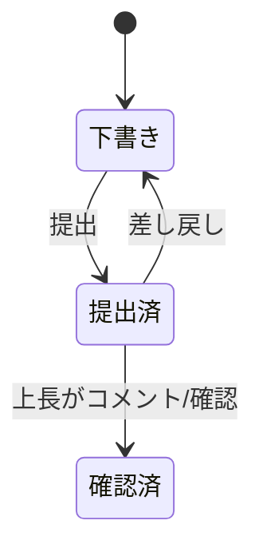
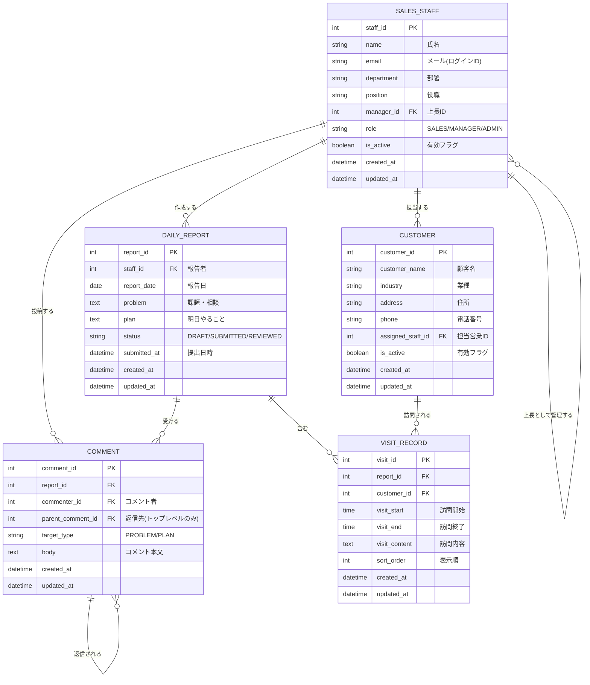

# 営業日報システム 要件定義書

Sep 23, 2026 · @Someone

## 1. システム概要・目的

営業担当者が日々の顧客訪問を記録し、上長がコメントでフィードバックできる営業日報システムを構築する。

- 目的1:訪問実績(誰に・何をしたか)を日単位で蓄積し、顧客別・担当者別に振り返れるようにする
- 目的2:課題・相談(Problem)と翌日の予定(Plan)を上長と共有し、早期に支援できるようにする
- 目的3:紙・Excel・メールに分散している日報を一元化する

対象範囲は日報の登録・閲覧・コメント、および顧客マスタ・営業マスタの管理とする。

## 2. 利用者とロール

利用者は「営業」「上長」「管理者」の3ロールとする。上長も営業マスタに登録された社員であり、営業マスタ内の上長IDで上下関係を表す。

| ロール | 主な操作 | 閲覧範囲 |
| --- | --- | --- |
| 営業 | 自分の日報の作成・編集・提出、コメント閲覧・返信 | 自分の日報 |
| 上長 | 部下の日報閲覧、Problem/Planへのコメント・返信 | 自分と直属部下の日報 |
| 管理者 | 顧客マスタ・営業マスタの登録・更新・無効化 | 全日報 |

## 3. 機能要件

日報は「1営業×1日=1件」とし、その下に訪問記録を複数行ぶら下げる構造とする。

| No | 機能 | 概要 | 利用ロール |
| --- | --- | --- | --- |
| F-01 | ログイン | 社員ID+パスワードで認証し、ロールに応じたメニューを表示 | 全員 |
| F-02 | 日報作成 | 報告日を指定して日報を作成。同一営業・同一日の日報は1件のみ | 営業 |
| F-03 | 訪問記録の追加 | 顧客マスタから顧客を選び、訪問内容を入力。1日報に複数行追加・削除・並び替え可 | 営業 |
| F-04 | Problem/Plan入力 | 今の課題・相談(Problem)と明日やること(Plan)をそれぞれ入力 | 営業 |
| F-05 | 日報提出 | 下書き→提出済に変更。提出後は上長に通知 | 営業 |
| F-06 | 日報一覧・検索 | 期間・営業・顧客で絞り込み。上長は部下分、管理者は全件 | 全員 |
| F-07 | コメント | 上長がProblem・Planそれぞれにコメントを複数件投稿。営業(日報の本人)と上長はコメントに返信可(1階層まで) | 上長・営業 |
| F-08 | 顧客マスタ管理 | 顧客の登録・更新・無効化(削除は論理削除) | 管理者 |
| F-09 | 営業マスタ管理 | 営業(社員)の登録・更新・無効化、上長の設定 | 管理者 |

日報のステータス遷移は以下のとおり。

## 4. データ要件(エンティティ定義)

テーブルは5つ。マスタ2つ(営業・顧客)、トランザクション3つ(日報・訪問記録・コメント)で構成する。

| テーブル | 論理名 | 役割 | 主な制約 |
| --- | --- | --- | --- |
| sales\_staff | 営業マスタ | 営業担当者・上長の情報 | manager\_idは自テーブル参照 |
| customer | 顧客マスタ | 訪問先の顧客情報 | 担当営業を任意で保持 |
| daily\_report | 日報 | 1営業1日1件のヘッダ。Problem/Planを持つ | (staff\_id, report\_date)で一意 |
| visit\_record | 訪問記録 | 日報明細。顧客+訪問内容 | 1日報に0〜n件 |
| comment | コメント | 上長からのコメントとその返信 | target\_typeでProblem/Planを区別。parent\_comment\_idで返信先を自テーブル参照 |

### 主要項目

- **sales\_staff**:staff\_id、氏名、メール、部署、役職、manager\_id(上長)、ロール、有効フラグ
- **customer**:customer\_id、顧客名、業種、住所、電話番号、担当営業ID、有効フラグ
- **daily\_report**:report\_id、staff\_id、report\_date、problem、plan、status、提出日時
- **visit\_record**:visit\_id、report\_id、customer\_id、訪問開始/終了時刻、訪問内容、表示順
- **comment**:comment\_id、report\_id、commenter\_id、parent\_comment\_id(返信先)、target\_type(PROBLEM/PLAN)、本文

全テーブル共通で作成日時・更新日時を持つ。

## 5. ER図(Mermaid)

コメントはProblemとPlanで別テーブルにせず、target\_typeで区別して1テーブルにまとめている。

返信も同じテーブルに持ち、parent\_comment\_idで返信先を表す。返信は1階層までとし、トップレベルのコメント(上長が投稿)にのみ返信できる。返信のtarget\_typeは返信先と同じ値にする。

## 6. 非機能要件

初期版の想定値。規模・運用が決まり次第見直す。

| 区分 | 要件 |
| --- | --- |
| 利用環境 | PCブラウザ+スマートフォン(外出先からの入力を想定) |
| 性能 | 一覧・検索画面は3秒以内に表示 |
| セキュリティ | ロール別アクセス制御、通信のHTTPS化、パスワードのハッシュ保存 |
| 可用性 | 平日営業時間帯の稼働を優先 |
| データ保持 | 日報は最低5年保持、マスタは論理削除で履歴を残す |
| 監査 | 日報・コメントの作成者と更新日時を記録 |

## 7. 未決事項・確認したい点

- [x] ~~コメントは上長のみか、営業も返信できるスレッド形式にするか~~ → 営業(本人)と上長が返信可、1階層まで(#1)
- [ ] 訪問記録に顧客側の面談者(担当者名)を持たせるか(顧客担当者マスタの要否)
- [ ] 訪問内容に商談ステータスや金額など構造化項目を持たせるか
- [ ] 上長は1人固定か、複数上長・部署単位の閲覧が必要か
- [ ] 提出後の編集可否と、差し戻し運用の有無
- [ ] 提出・コメント時の通知手段(メール/チャット)

## 8. 画面設計

@doc/SCREEN_DESIGN.md

## 9. API仕様書

@doc/API_SCHEME.md

## 9. テスト仕様書

@doc/TEST_DEFINITION.md

## 10. 使用技術

**言語** TypeScrit
**フレームワーク** Next.js(App Router)
**UIコンポーネント** shadcn/ui + Tailwind CSS
**APIスキーマ定義** OpenAPI(Zodによる検証)
**DBスキーマ定義** Prisma.jp
**デプロイ** Google Cloud Run