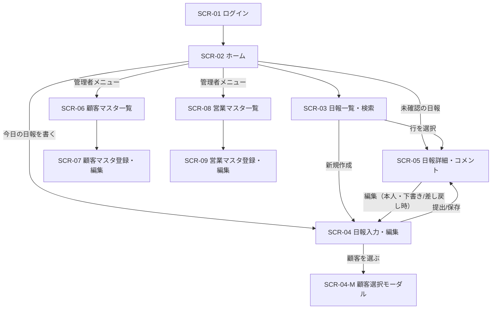

# 営業日報システム 画面定義書

作成日：2026-09-23
関連資料：営業日報システム 要件定義書

---

## 1. 画面一覧

| 画面ID | 画面名 | 概要 | 営業 | 上長 | 管理者 | 対応機能 |
| --- | --- | --- | :-: | :-: | :-: | --- |
| SCR-01 | ログイン | 社員ID（メール）とパスワードで認証 | ○ | ○ | ○ | F-01 |
| SCR-02 | ホーム | ロール別のToDo（未提出・未確認）を表示 | ○ | ○ | ○ | - |
| SCR-03 | 日報一覧・検索 | 期間・営業・顧客・ステータスで日報を検索 | ○ | ○ | ○ | F-06 |
| SCR-04 | 日報入力・編集 | 訪問記録（複数行）とProblem/Planを入力・提出 | ○ | - | - | F-02〜F-05 |
| SCR-04-M | 顧客選択モーダル | 訪問記録に設定する顧客を検索・選択 | ○ | - | - | F-03 |
| SCR-05 | 日報詳細・コメント | 日報の閲覧、Problem/Planへのコメント・返信、確認・差し戻し | ○ | ○ | ○ | F-06, F-07 |
| SCR-06 | 顧客マスタ一覧 | 顧客の検索・一覧 | △ | △ | ○ | F-08 |
| SCR-07 | 顧客マスタ登録・編集 | 顧客の登録・更新・無効化 | - | - | ○ | F-08 |
| SCR-08 | 営業マスタ一覧 | 営業（社員）の検索・一覧 | - | - | ○ | F-09 |
| SCR-09 | 営業マスタ登録・編集 | 営業の登録・更新・無効化、上長の設定 | - | - | ○ | F-09 |

凡例：○＝利用可、△＝閲覧のみ、-＝利用不可

---

## 2. 画面遷移図



---

## 3. 共通仕様

| 項目 | 仕様 |
| --- | --- |
| ヘッダー | システム名、ログインユーザー名・ロール、ログアウトボタン |
| グローバルメニュー | ホーム／日報一覧／（管理者のみ）顧客マスタ・営業マスタ |
| 対応端末 | PCブラウザ、スマートフォン（SCR-04・SCR-05はスマホ入力を優先して設計） |
| 日付形式 | YYYY/MM/DD（曜日を併記） |
| 時刻形式 | HH:MM（24時間表記、15分刻み入力を推奨） |
| メッセージ | 成功：画面上部にトースト表示／エラー：項目直下に赤字表示 |
| 未保存離脱 | 入力中に画面遷移する場合は確認ダイアログを表示 |
| セッション | 無操作60分でタイムアウトし、SCR-01へ遷移 |

---

## 4. 画面詳細

### SCR-01 ログイン

**目的**：利用者を認証し、ロールに応じたホームへ遷移する。

```
+--------------------------------------+
|          営業日報システム            |
|                                      |
|  メールアドレス [                  ] |
|  パスワード     [                  ] |
|                                      |
|             [ ログイン ]             |
+--------------------------------------+
```

| No | 項目名 | 種別 | 必須 | 形式・桁 | 備考 |
| --- | --- | --- | :-: | --- | --- |
| 1 | メールアドレス | テキスト | ○ | メール形式、254桁 | sales_staff.email |
| 2 | パスワード | パスワード | ○ | 8〜64桁 | マスク表示 |
| 3 | ログイン | ボタン | - | - | 認証成功でSCR-02へ |

**入力チェック・エラー**
- 未入力：「メールアドレスを入力してください」等
- 認証失敗：「メールアドレスまたはパスワードが正しくありません」（どちらが誤りかは明示しない）
- 無効化された社員（is_active=false）はログイン不可

---

### SCR-02 ホーム

**目的**：ロールごとに「今やるべきこと」を一目で把握させる。

```
+--------------------------------------------------+
| ヘッダー / メニュー                              |
+--------------------------------------------------+
| 【営業】                                         |
|  今日の日報：未作成  [ 今日の日報を書く ]         |
|  下書き・差し戻し中の日報（件数とリンク）         |
|  新着コメント・返信（最新5件）                    |
|                                                  |
| 【上長】                                         |
|  未確認の部下日報（提出済）一覧  → 行クリックで   |
|  SCR-05                                          |
|  本日未提出の部下一覧                             |
|  自分のコメントへの返信（最新5件）                |
+--------------------------------------------------+
```

| No | 項目名 | 種別 | 表示ロール | 備考 |
| --- | --- | --- | --- | --- |
| 1 | 今日の日報ステータス | ラベル | 営業 | 未作成／下書き／提出済／差し戻し／確認済 |
| 2 | 今日の日報を書く | ボタン | 営業 | 未作成なら新規、作成済なら編集でSCR-04へ |
| 3 | 下書き・差し戻し一覧 | リスト | 営業 | status=DRAFT / RETURNED。報告日、ステータス（差し戻しは目立つ色で表示）。クリックでSCR-04 |
| 4 | 新着コメント | リスト | 営業 | 自分の日報へのコメント・返信（自分の投稿を除く）。日付、コメント者、対象（Problem/Plan）、返信かどうか、本文冒頭30文字。クリックでSCR-05 |
| 5 | 未確認の部下日報 | リスト | 上長 | status=SUBMITTED。報告日、営業名、訪問件数、提出日時 |
| 6 | 本日未提出の部下 | リスト | 上長 | 営業名、当日のステータス |
| 7 | 自分のコメントへの返信 | リスト | 上長 | 部下からの返信（自分の投稿を除く）。日付、返信者、対象（Problem/Plan）、本文冒頭30文字。クリックでSCR-05 |

---

### SCR-03 日報一覧・検索

**目的**：条件を指定して日報を探し、詳細へ遷移する。

```
+---------------------------------------------------------------+
| 検索条件                                                       |
|  期間 [2026/09/01]〜[2026/09/30]  営業 [▼全員]                  |
|  顧客 [    ] ステータス [☑下書き ☑提出済 ☑差し戻し ☑確認済]     |
|                               [ クリア ] [ 検索 ]  [ 新規作成 ] |
+---------------------------------------------------------------+
| 報告日      | 営業名 | 訪問件数 | 訪問先（先頭2件） | 状態 | コメント |
| 2026/09/22 | 山田   | 3        | A社, B社 …        | 提出済 | 1      |
| ...                                                           |
+---------------------------------------------------------------+
|                    < 1 2 3 >  20件/ページ                      |
+---------------------------------------------------------------+
```

**検索条件**

| No | 項目名 | 種別 | 必須 | 初期値 | 備考 |
| --- | --- | --- | :-: | --- | --- |
| 1 | 期間（開始） | 日付 | - | 当月1日 | 開始≦終了 |
| 2 | 期間（終了） | 日付 | - | 当日 | |
| 3 | 営業 | プルダウン | - | 営業：自分固定／上長：全員（部下）／管理者：全員 | 営業ロールは変更不可 |
| 4 | 顧客 | テキスト（部分一致） | - | 空 | 訪問記録の顧客名で検索 |
| 5 | ステータス | チェックボックス | - | 全選択 | 上長・管理者には下書きは表示しない（要確認） |

**一覧項目**

| No | 項目名 | 備考 |
| --- | --- | --- |
| 1 | 報告日 | 降順ソート（初期） |
| 2 | 営業名 | |
| 3 | 訪問件数 | visit_recordの件数 |
| 4 | 訪問先 | 先頭2件の顧客名＋「他n件」 |
| 5 | ステータス | 下書き／提出済／差し戻し／確認済（DRAFT / SUBMITTED / RETURNED / REVIEWED） |
| 6 | コメント数 | |

**操作**：行クリックでSCR-05、「新規作成」（営業のみ表示）でSCR-04。

---

### SCR-04 日報入力・編集

**目的**：1日分の訪問記録（複数行）とProblem/Planを入力し、提出する。

```
+----------------------------------------------------------------+
| 報告日 [2026/09/23(水)]            ステータス：下書き            |
+----------------------------------------------------------------+
| ■ 訪問記録                                                     |
|  # | 顧客        | 開始  | 終了  | 訪問内容                | 操作 |
|  1 | [A社   🔍]  |[10:00]|[11:00]| [提案書の説明。…      ] | ↑↓ 🗑 |
|  2 | [B社   🔍]  |[14:00]|[15:00]| [定例会。…            ] | ↑↓ 🗑 |
|                                           [ ＋ 訪問を追加 ]      |
+----------------------------------------------------------------+
| ■ Problem（今の課題・相談）                                      |
|  [                                                          ]  |
| ■ Plan（明日やること）                                           |
|  [                                                          ]  |
+----------------------------------------------------------------+
| ■ 上長コメント（差し戻し時・コメントありの場合のみ表示。返信も含む）|
+----------------------------------------------------------------+
|        [ キャンセル ]   [ 下書き保存 ]   [ 提出する ]            |
+----------------------------------------------------------------+
```

**ヘッダー部**

| No | 項目名 | 種別 | 必須 | 形式・桁 | 備考 |
| --- | --- | --- | :-: | --- | --- |
| 1 | 報告日 | 日付 | ○ | YYYY/MM/DD | 初期値＝当日。未来日は不可。同一営業・同一日の日報が既にあればその日報を開く |
| 2 | ステータス | ラベル | - | - | 表示のみ |

**訪問記録（明細・複数行）**

| No | 項目名 | 種別 | 必須 | 形式・桁 | 備考 |
| --- | --- | --- | :-: | --- | --- |
| 1 | 顧客 | 選択（SCR-04-M） | ○ | - | 有効な顧客のみ選択可。visit_record.customer_id |
| 2 | 訪問開始 | 時刻 | - | HH:MM | |
| 3 | 訪問終了 | 時刻 | - | HH:MM | 開始≦終了 |
| 4 | 訪問内容 | テキストエリア | ○ | 2,000文字以内 | visit_record.visit_content |
| 5 | 並び替え | ボタン（↑↓） | - | - | sort_orderを更新 |
| 6 | 削除 | ボタン | - | - | 確認ダイアログ後に行削除 |
| 7 | 訪問を追加 | ボタン | - | - | 空行を末尾に追加。上限20行 |

**Problem / Plan**

| No | 項目名 | 種別 | 必須 | 形式・桁 | 備考 |
| --- | --- | --- | :-: | --- | --- |
| 1 | Problem | テキストエリア | 提出時○ | 2,000文字以内 | daily_report.problem。「特になし」も可 |
| 2 | Plan | テキストエリア | 提出時○ | 2,000文字以内 | daily_report.plan |

**操作**

| ボタン | 動作 | 遷移先 |
| --- | --- | --- |
| キャンセル | 未保存確認後に戻る | 前画面 |
| 下書き保存 | ステータスは変えずに保存（新規は DRAFT、差し戻し中は RETURNED のまま）。必須チェックは顧客のみ | 同画面（トースト表示） |
| 提出する | 全必須チェック後、確認ダイアログ→status=SUBMITTED、submitted_at記録、上長に通知 | SCR-05 |

**入力チェック**
- 提出時は訪問記録が1行以上必要（訪問なしの日の扱いは要確認）
- 訪問終了が開始より前の場合：「終了時刻は開始時刻以降にしてください」
- 提出済・確認済の日報は編集不可。編集できるのは下書き（DRAFT）と差し戻し（RETURNED）のみ

---

### SCR-04-M 顧客選択モーダル

**目的**：訪問記録に設定する顧客を素早く探して選ぶ。

| No | 項目名 | 種別 | 備考 |
| --- | --- | --- | --- |
| 1 | キーワード | テキスト | 顧客名の部分一致（入力に応じて絞り込み） |
| 2 | 担当顧客のみ | チェックボックス | 初期ON。assigned_staff_id＝ログインユーザー |
| 3 | 顧客一覧 | リスト | 顧客名、業種、住所。クリックで選択しモーダルを閉じる |

補足：最近訪問した顧客（直近10件）を一覧の上部に表示する。

---

### SCR-05 日報詳細・コメント

**目的**：日報内容を確認し、上長がProblem/Planそれぞれにコメントする。日報の本人と上長はコメントに返信できる（1階層まで）。

```
+----------------------------------------------------------------+
| 2026/09/22(火)  山田 太郎   ステータス：提出済   提出 18:05      |
|                                  [ 編集 ]（本人・編集可能時のみ）|
+----------------------------------------------------------------+
| ■ 訪問記録                                                     |
|  10:00-11:00  A社   提案書の説明。先方は…                        |
|  14:00-15:00  B社   定例会。…                                   |
+----------------------------------------------------------------+
| ■ Problem                                                      |
|  B社の値引き要求にどこまで応じるべきか相談したい。               |
|   └ 💬 佐藤部長 09/22 19:10  「10%までなら可。明日話そう」       |
|       ↳ 山田 09/22 19:30  「ありがとうございます。10%で提示します」|
|       [ 返信を入力…                          ] [ 返信 ]          |
|   [ コメントを入力…                          ] [ 投稿 ]  ←上長のみ|
+----------------------------------------------------------------+
| ■ Plan                                                         |
|  C社へ見積提出。…                                                |
|   └ 💬（コメントなし）                                           |
|   [ コメントを入力…                          ] [ 投稿 ]          |
+----------------------------------------------------------------+
|             [ 差し戻す ]   [ 確認済にする ]   ← 上長のみ         |
+----------------------------------------------------------------+
```

**表示項目**

| No | 項目名 | 備考 |
| --- | --- | --- |
| 1 | 報告日・営業名・ステータス・提出日時 | ヘッダー表示 |
| 2 | 訪問記録 | sort_order順。時刻・顧客名・訪問内容 |
| 3 | Problem / Plan | 本文。改行を保持して表示 |
| 4 | コメント一覧 | 対象（Problem/Plan）ごとに時系列表示。コメント者名・日時・本文 |
| 5 | 返信 | 各コメントの下に字下げして時系列表示。返信者名・日時・本文 |

**コメント入力（上長のみ表示）**

| No | 項目名 | 種別 | 必須 | 形式・桁 | 備考 |
| --- | --- | --- | :-: | --- | --- |
| 1 | コメント本文 | テキストエリア | ○ | 1,000文字以内 | Problem欄・Plan欄それぞれに配置。comment.target_typeを自動設定 |
| 2 | 投稿 | ボタン | - | - | 投稿後、営業に通知 |

**返信入力（日報の本人、または直属の上長のみ表示。R-03 の `permissions.can_reply` が true のとき）**

| No | 項目名 | 種別 | 必須 | 形式・桁 | 備考 |
| --- | --- | --- | :-: | --- | --- |
| 1 | 返信本文 | テキストエリア | ○ | 1,000文字以内 | 各コメント（トップレベル）の下に配置。返信への返信欄は設けない。target_typeは返信先と同じ |
| 2 | 返信 | ボタン | - | - | 投稿後、日報の本人と返信先コメントの投稿者に通知（投稿者本人は除く） |

スマホでは、返信欄は「返信する」ボタンを押したときだけ開く。

**操作**

| ボタン | 表示条件 | 動作 |
| --- | --- | --- |
| 編集 | 本人かつ下書き／差し戻し | SCR-04へ |
| 確認済にする | 上長かつ提出済 | status=REVIEWED |
| 差し戻す | 上長かつ提出済 | 差し戻し理由（コメント）必須→status=RETURNED、営業に通知 |

---

### SCR-06 顧客マスタ一覧

| No | 項目名 | 種別 | 備考 |
| --- | --- | --- | --- |
| 1 | 顧客名 | 検索条件（部分一致） | |
| 2 | 業種 | 検索条件（プルダウン） | |
| 3 | 担当営業 | 検索条件（プルダウン） | |
| 4 | 無効も表示 | 検索条件（チェック） | 初期OFF |
| 5 | 一覧 | テーブル | 顧客名、業種、住所、電話番号、担当営業、有効/無効 |
| 6 | 新規登録 | ボタン | 管理者のみ。SCR-07へ |

行クリックでSCR-07（管理者は編集、その他ロールは閲覧のみ）。

---

### SCR-07 顧客マスタ登録・編集

| No | 項目名 | 種別 | 必須 | 形式・桁 | 備考 |
| --- | --- | --- | :-: | --- | --- |
| 1 | 顧客ID | ラベル | - | - | 自動採番。編集時のみ表示 |
| 2 | 顧客名 | テキスト | ○ | 100文字以内 | 同名の有効顧客がある場合は警告（登録は可） |
| 3 | 業種 | プルダウン | - | - | 選択肢は別途定義 |
| 4 | 住所 | テキスト | - | 200文字以内 | |
| 5 | 電話番号 | テキスト | - | 半角数字・ハイフン、20桁 | |
| 6 | 担当営業 | プルダウン | - | - | 有効な営業のみ |
| 7 | 有効フラグ | トグル | ○ | - | 無効化すると訪問記録の選択肢から除外（過去の日報には表示を残す） |
| 8 | 保存 / キャンセル | ボタン | - | - | 保存後SCR-06へ |

---

### SCR-08 営業マスタ一覧

| No | 項目名 | 種別 | 備考 |
| --- | --- | --- | --- |
| 1 | 氏名 | 検索条件（部分一致） | |
| 2 | 部署 | 検索条件（プルダウン） | |
| 3 | ロール | 検索条件（プルダウン） | 営業／上長／管理者 |
| 4 | 無効も表示 | 検索条件（チェック） | 初期OFF |
| 5 | 一覧 | テーブル | 氏名、メール、部署、役職、上長、ロール、有効/無効 |
| 6 | 新規登録 | ボタン | SCR-09へ |

---

### SCR-09 営業マスタ登録・編集

| No | 項目名 | 種別 | 必須 | 形式・桁 | 備考 |
| --- | --- | --- | :-: | --- | --- |
| 1 | 社員ID | ラベル | - | - | 自動採番。編集時のみ表示 |
| 2 | 氏名 | テキスト | ○ | 50文字以内 | |
| 3 | メールアドレス | テキスト | ○ | メール形式、254桁 | ログインID。重複不可 |
| 4 | 部署 | テキスト/プルダウン | ○ | 50文字以内 | |
| 5 | 役職 | テキスト | - | 50文字以内 | |
| 6 | 上長 | プルダウン | - | - | 自分自身は選択不可。循環（AがBの上長かつBがAの上長）を禁止 |
| 7 | ロール | ラジオ | ○ | SALES / MANAGER / ADMIN | |
| 8 | 初期パスワード | パスワード | 新規時○ | 8〜64桁 | 初回ログイン時に変更を促す |
| 9 | 有効フラグ | トグル | ○ | - | 無効化すると即時ログイン不可。部下がいる場合は警告 |
| 10 | 保存 / キャンセル | ボタン | - | - | 保存後SCR-08へ |

---

## 5. 画面・テーブル対応表

| 画面ID | sales_staff | customer | daily_report | visit_record | comment |
| --- | :-: | :-: | :-: | :-: | :-: |
| SCR-01 | R | | | | |
| SCR-02 | R | | R | R | R |
| SCR-03 | R | R | R | R | R |
| SCR-04 | R | R | CRU | CRUD | R |
| SCR-04-M | | R | | R | |
| SCR-05 | R | R | RU | R | CR |
| SCR-06 | R | R | | | |
| SCR-07 | R | CRU | | | |
| SCR-08 | R | | | | |
| SCR-09 | CRU | | | | |

C=登録 R=参照 U=更新 D=削除（マスタは論理削除のためUで表現）

---

## 6. 画面に関する未決事項

- [ ] 訪問のない日（内勤日）も日報を提出させるか。その場合、訪問記録0件での提出を許可するか
- [ ] 上長・管理者に部下の「下書き」を見せるか
- [x] ~~営業がコメントに返信できるようにするか（SCR-05のスレッド化）~~ → 本人と上長が返信可、1階層まで（#1）
- [x] ~~差し戻しをステータスとして独立させるか~~ → RETURNED を採用（#2）
- [ ] 業種の選択肢の定義
- [ ] スマホで訪問記録を入力する際、1行ずつ別画面で入力するUIにするか
